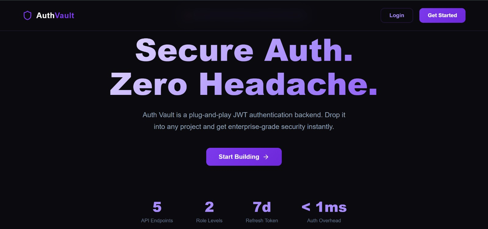
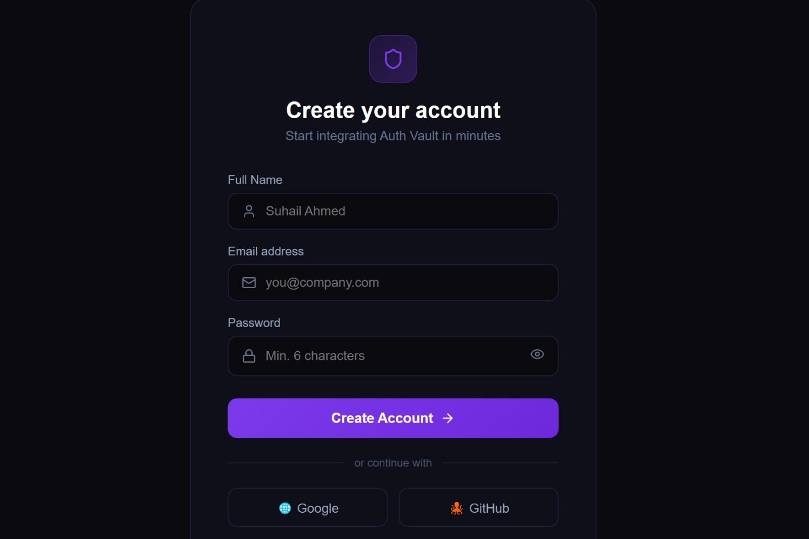
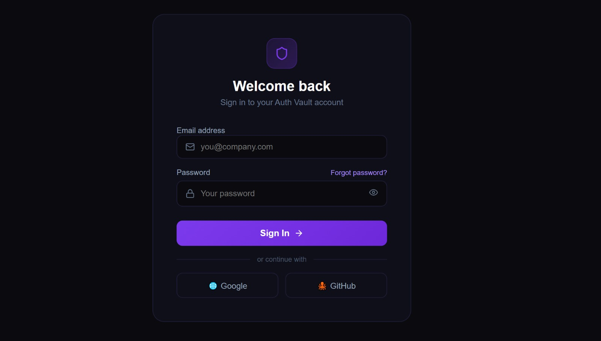

# 📸 Application Flow

## 🏠 1. Landing Page

The entry point of Auth Vault where developers can explore the platform and begin authentication.

<p align="center">
  
</p>

---

## 📝 2. Registration

Developers can securely create an account to access the platform.

<p align="center">
  
</p>

---

## 🔑 3. Login

Registered users authenticate themselves and obtain access to their dashboard.

<p align="center">
  
</p>

---

## 👨‍💻 4. Developer Dashboard

After login, developers can manage authentication resources and API integrations.

<p align="center">
  
</p>

---

## 📱 5. Application Dashboard

Developers can manage connected applications and monitor their integrations.

<p align="center">
  
</p>

---

## ✨ Features

* User Registration
* User Login
* JWT Access Token Authentication
* Refresh Token Support
* BCrypt Password Hashing
* API Key Generation & Management
* Protected REST APIs
* Spring Security Integration
* Global Exception Handling
* Request Validation
* DTO-based API Design
* Swagger/OpenAPI Documentation

---

## 🛠 Tech Stack

### Backend

* Java 21
* Spring Boot
* Spring Security
* Spring Data JPA
* JWT (JSON Web Tokens)
* Hibernate
* MySQL
* Maven

### Tools

* IntelliJ IDEA
* Postman
* Git & GitHub

---

## 🏗 Architecture

```text
Client
   │
   ▼
Controller
   │
   ▼
Service
   │
   ▼
Repository
   │
   ▼
Database
```

### Authentication Flow

```text
Login Request
      │
      ▼
Authenticate Credentials
      │
      ▼
Generate JWT + Refresh Token
      │
      ▼
Return Tokens
      │
      ▼
Client Stores Tokens
      │
      ▼
Protected Requests
      │
      ▼
JWT Filter
      │
      ▼
Token Validation
      │
      ▼
Access Granted
```

---

## 📂 Project Structure

```text
src
 ├── config
 ├── controller
 ├── dto
 ├── entity
 ├── exception
 ├── repository
 ├── security
 ├── service
 ├── util
 └── validation
```

---

## 📡 API Endpoints

### Authentication

| Method | Endpoint       | Description                 |
| ------ | -------------- | --------------------------- |
| POST   | /auth/register | Register a new user         |
| POST   | /auth/login    | Authenticate user           |
| POST   | /auth/refresh  | Generate a new access token |

### Protected

| Method | Endpoint  | Description                             |
| ------ | --------- | --------------------------------------- |
| GET    | /users/me | Retrieve authenticated user information |

---

## 🔒 Security

* BCrypt Password Hashing
* JWT Access Tokens
* Refresh Token Mechanism
* Stateless Authentication
* Spring Security Filter Chain
* Protected API Endpoints
* Secure API Key Management

---

## 🚀 Getting Started

### Clone Repository

```bash
git clone https://github.com/<your-username>/auth-vault.git
```

### Configure Database

Update your `application.properties` with your MySQL credentials.

### Run Application

```bash
mvn spring-boot:run
```

Open Swagger Documentation:

```text
http://localhost:8080/swagger-ui.html
```

---

## 📖 Future Improvements

* Email Verification
* Password Reset
* OAuth2 (Google/GitHub)
* Docker Deployment
* Redis Token Store
* Role-Based Authorization (RBAC)
* Rate Limiting
* Multi-Tenant Support
* Monitoring & Logging
* CI/CD Pipeline

---

## 🎯 Purpose

This project was built to strengthen backend engineering skills and demonstrate the implementation of secure authentication systems using Spring Boot and JWT while following clean architecture and industry best practices.

The long-term vision is to evolve Auth Vault into a reusable authentication platform that can be integrated into multiple applications through APIs and API keys.

---

## 📄 License

This project is intended for educational and portfolio purposes.

```

This structure puts screenshots near the top, which is where recruiters usually look first. The first thing they will see is:

**Project → UI → Flow → Features → Code Architecture**

This significantly improves portfolio presentation.
```
